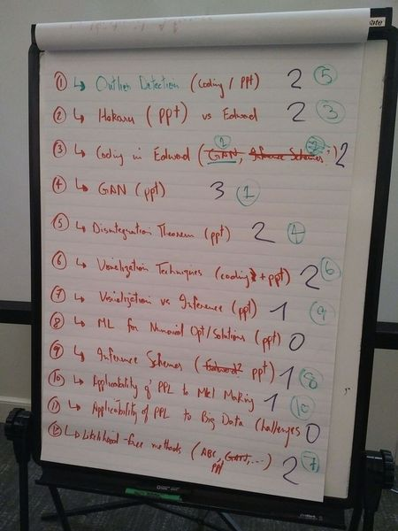

# Recent Developments in Probabilistic Programming

This session was a brainstorming session the outcome of which was a rough
roadmap of possible topics the group wanted to explore. There were no
presentations in this session.

## Brainstorming Flipboard

## Rough roadmap
1. Generative Adversarial Networks (GANs)
2. Coding in Edward (GAN related hopefully)
3. Hakaru vs Edward (ppt)
4. Disintegration theorem (ppt)
5. Outlier detection (coding session / ppt)
6. Visualization techniques (coding + ppt)
7. Likelihood-free (Approximate Bayesian Computation, GANs) methods (ppt)
8. Inference schemes (ppt)
9. Visualization vs Inference (ppt)
10. Applicability of PPS to market making
